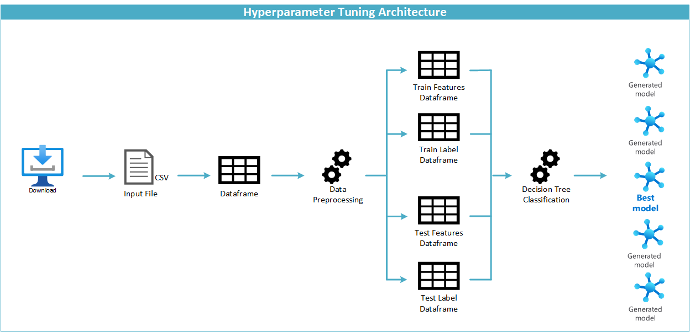

# Capstone Project

This is the capstone project for the Machine Learning Engineer with Microsoft Azure, Udacity Nanodegree.  
The objective is to compare the performance between a model optimized through hyperparameter tuning and the best model generated through AutoML.  


## Project Set Up and Installation
The underlying environment for the execution of the Jupyter notebooks must be Unix. The OS commands used will not run in a Windows environment.  

This project requires the installation of the following libraries:
* Azure Machine Learning SDK for Python  
* Python 3.6.2  
* Scikit-learn

Please make sure that the following libraries of Azure Machine Learning are compatible:  
* azureml.core  
* azureml.data  
* azureml.train  
* azureml.widgets  
* azureml.automl  

**For unknown reasons, there is an inconsistency between the versions installed in Azure ML Studio.**  
When the Jupyter notebooks were executed in a compute instance of Azure Machine Learning Studio, the train library version was 1.20, whereas the rest of the components were version 1.19.  
I tried updating the versions of the libraries in Azure Machine Learning Studio, without success.  
The alternative used, was to execute the Jupyter notebooks in a local environment, where all AzureML libraries were updated to version 1.20.  


## Dataset

### Overview
The dataset selected for the project is the UCI [Estimation of Obesity Levels Data Set](https://archive.ics.uci.edu/ml/datasets/Estimation+of+obesity+levels+based+on+eating+habits+and+physical+condition+).  
The dataset includes data for the estimation of obesity levels in individuals from the countries of Mexico, Peru, and Colombia, based on their eating habits and physical condition.  

"Mexico is one of the most worrying cases. About 73% of the Mexican population is overweight (compared to one-fifth of the population in 1996).  
Mexico has one of the highest rates of obesity in the OECD. In addition, 34% of obese are morbidly obese - the highest level of obesity.  
According to our projections, overweight-related diseases will reduce life expectancy in Mexico by more than 4 years over the next 30 years. This is the largest projected reduction among OECD countries.  
But the greatest tragedy is the growth in child obesity, which has doubled from 7.5% in 1996 to 15% in 2016."
[The Heavy Burden of Obesity: The Economics of Prevention](https://www.oecd.org/about/secretary-general/heavy-burden-of-obesity-mexico-january-2020.htm).  

The reason why I selected this dataset is because obesity is a serious problem in my home country, Mexico.  
Despite several efforts made by the government, like increasing taxes in high sugar content beverages and most recently, the labeling of foods containing high calories / sugar / sodium / fat, the problem persists.  
Due the pandemic, this problem can become worse, since we must stay home.  Keeping a healthy lifestyle during lockdown requires a strong will.  
So, I was delighted to find a dataset related to the subject, where eating habits and physical conditions are provided as features, to determine which ones might be the principal cause of obesity levels.  


### Task
The data contains 17 attributes and 2,111 records. The records are labeled with the class variable NObesity (Obesity Level), which allows classification of the data.  
A detailed explanation of the dataset and the Exploratory Data Analysis tasks performed are included in the [01. Exploratory Data Analysis notebook](notebooks/01. Exploratory Data Analysis.ipynb).  


### Access
To access the dataset:  
* A zip file was downloaded locally from the UCI website.  
```
!wget -O ObesityDataSet.zip  'https://archive.ics.uci.edu/ml/machine-learning-databases/00544/ObesityDataSet_raw_and_data_sinthetic%20(2).zip'
```

* The zipfile was decompressed locally, obtaining a csv file.  
```
!unzip ObesityDataSet.zip
```

* For Hyperparameter tuning, the local dataset file was copied to the project folder.  
```
shutil.copy('../dataset/ObesityDataSet_raw_and_data_sinthetic.csv', project_folder)
```

* For AutoML the file was uploaded to the workspace blob storage and a tabular dataset was created from this uploaded file.  
```
datastore = Datastore.get(ws, 'workspaceblobstore')
datastore.upload_files(files = ['../dataset/ObesityDataSet_raw_and_data_sinthetic.csv'],
                       target_path = 'capstone-dataset/',
                       overwrite = True,
                       show_progress = True)
dataset = Dataset.Tabular.from_delimited_files(path = [(datastore, 'capstone-dataset/ObesityDataSet_raw_and_data_sinthetic.csv')])
```

## Automated ML

### Architecture Diagram


### Automated ML Settings

The settings used were:  

* Experiment timeout.  
This is the maximum amount of time in minutes that all iterations combined can take before the experiment terminates.  
If not specified, the default experiment timeout is 6 days.  
It was set to 20 minutes, so the experiment would not run for a long time and consume too many resources.  

* Maximum concurrent iterations.  
This represents the maximum number of iterations that would be executed in parallel.  
The default value is 1.  
AmlCompute clusters support one iteration running per node. For multiple AutoML experiment parent runs executed in parallel on a single AmlCompute cluster, the sum of the values for all experiments should be less than or equal to the maximum number of nodes. Otherwise, runs will be queued until nodes are available.  
It was set to 4, since the cluster was configured to have 4 nodes.  

* Primary Metric.  
To evaluate the performance of the models, *accuracy* was selected.  
Accuracy is a popular choice because it is very easy to understand and explain.  
In this dataset, the identification of positives is not crucial (sensitivity/recall), there is no need to be more confident of the predicted positives (precision), there is no need to cover all true negatives (specificity), and there is not an uneven class distribution (F1).  

References:  
[AutoMLConfig Class](https://docs.microsoft.com/en-us/python/api/azureml-train-automl-client/azureml.train.automl.automlconfig.automlconfig?view=azure-ml-py).  
[How to select Performance Metrics for Classification Models](https://medium.com/analytics-vidhya/how-to-select-performance-metrics-for-classification-models-c847fe6b1ea3).


### Automated ML Configuration
The configuration used was:  
* Task.  
It was set to *classification*, since the problem to solve is to determine the class of Obesity level based on the attribites provided.  
* Enable ONNX Compatible Models.  
It was set True, to save the model as ONNX
* Featurization.  
It was set to auto, to enable the featurization step, since the dataset is not preprocessed.  


### Results

#### Model Analysis
The best model was a *Voting Ensemble* model.  
For this model there are no configurable parameters, except the timeout. No modifications were needed, since there were no error messages.  


As the images show, the best model is Voting Ensemble.  

A voting ensemble is an ensemble ML model that combines the predictions from multiple other models. The predictions for each label are summed and the label with the majority vote is predicted.  
The voting ensemble in Azure ML implements soft-voting, which uses weighted averages.  

This model considered the best 6 models, assigning them the same weighted average (0.16666666666666666).  
* MaxAbsScaler, LightGBMClassifier  
* SparseNormalizer, XGBoostClassifier  
* StandardScalerWrapper, XGBoostClassifier  
* StandardScalerWrapper, XGBoostClassifier  
* SparseNormalizer, XGBoostClassifier  
* SparseNormalizer, XGBoostClassifier

References:  
[How to Develop Voting Ensembles With Python](https://machinelearningmastery.com/voting-ensembles-with-python)  
[Configure automated ML experiments in Python](https://docs.microsoft.com/en-us/azure/machine-learning/how-to-configure-auto-train)  


#### RunDetails
The screenshots of the *RunDetails* widget and the best model are as follows:  


## Hyperparameter Tuning

### Architecture Diagram



### Hyperparameter Tuning Settings

#### Model selection
In the [03. Model Selection notebook](03.%20Model%20Selection.ipynb), different tests were conducted to determine the model to be used in the project.  
The model selected was *Decision Trees*.  


#### Performance Metric selection
To evaluate the performance of the models, *Accuracy* was selected.  
Accuracy is a popular choice because it is very easy to understand and explain.  

In this dataset, the identification of positives is not crucial (sensitivity/recall), there is no need to be more confident of the predicted positives (precision), there is no need to cover all true negatives (specificity), and there is not an uneven class distribution (F1).  

Reference: [How to select Performance Metrics for Classification Models](https://medium.com/analytics-vidhya/how-to-select-performance-metrics-for-classification-models-c847fe6b1ea3).  


#### Termination policy
An early termination policy improves computational efficiency by automatically terminating poorly performing runs.  
For aggressive savings, a *Bandit Policy* with small allowable slack is recommended.  
Bandit is based on slack factor/slack amount and evaluation interval. The policy early terminates any runs where the primary metric is not within the specified slack factor/slack amount with respect to the best performing training run.  

References: [Tune hyperparameters for your model with Azure Machine Learning](https://docs.microsoft.com/en-us/azure/machine-learning/how-to-tune-hyperparameters) and [Define a Bandit policy for early termination of HyperDrive runs](https://azure.github.io/azureml-sdk-for-r/reference/bandit_policy.html#:~:text=Bandit%20is%20an%20early%20termination,the%20best%20performing%20training%20run.).  

The values selected for the policy were a *slack factor* of 0.1 and a *evaluation interval* of 2.  
The early termination policy is applied every 2 intervals, when metrics are reported. Any run whose accuracy is less than (1 / (1 + 0.1)) or 91\% of the best run will be terminated.  


#### Parameter sampler
For hyperparameter sampling, there are 3 types of sampling algorithms:
* Bayesian Sampling
* Grid Sampling
* Random Sampling

**Bayesian Sampling.**  
Picks samples based on how previous samples performed, so the new samples improve the primary metric.  
It is recommended if there is enough budget to explore the hyperparameter space and does not support early termination policies.  

**Grid Sampling.**  
Performs a simple grid search over all possible values.  
It is recommended if there is enough budget to exhaustively search over the search space. Supports early termination of low-performance runs.  

**Random Sampling.**
Hyperparameters are randomly selected from the defined search space.  
It supports early termination of low-performance runs.  

Random sampling was selected for the test, since it is the algorithm that consumes less resources and accepts an early termination policy.  

Reference: https://docs.microsoft.com/en-us/azure/machine-learning/how-to-tune-hyperparameters#define-search-space  


#### Parameter space
In the [04. Hyperparameters Testing](04.%20Hyperparameters%20Testing.ipynb), different tests were conducted to determine the values of the hyperparameters to test.  

The hyperparameters to test are:
* Maximum depth of the tree (max_depth).  
* Minimum number of samples required to split (min_samples_split).  

**Maximum depth.**  
This is the maximum depth of the tree.  
The default value is *None*.  
A high value causes overfitting. A low value causes underfitting.  
The values selected for the pre-test were 5, 10, 50, 100 to test underfitting and overfitting.  

**Minimum number of samples.**  
This is the minimum number of samples required to split an internal node.  
The default value is 2.  
The values selected for the sampler were 2, 10, 50, 100 to see the effect of the selecting too few and too many samples.  

**Note:** *random_state* was set to 0, to obtain a deterministic behavior during fitting.  
This parameter controls the randomness of the estimator. If set to the default value *None*, the features are randomly permuted at each split. The best found split may vary across different runs.  


#### Configuration settings
The total of runs was set to 20 and the maximum concurrent runs was set to 4, to avoid overconsumption of resources.  


### Results
The best model was a *Decision Tree* with 10 maximum depth levels and 2 minimum number of samples.  


#### RunDetails
The screenshots of the *RunDetails* widget and the best model are as follows:  


## Model Deployment
The deployed model was the *Voting Ensemble* model generated by AutoML.  
The steps followed were:
* Get the Auto ML run and the Best Model.  
```
best_run_ml, fitted_model_ml = remote_run.get_output()
```

* Obtain the scoring script of the best model.  
```
script_file_name = 'inference/score.py'
best_run_ml.download_file('outputs/scoring_file_v_1_0_0.py', 'inference/score.py')
```

* Register the model.  
```
registered_model = remote_run.register_model(model_name = 'capstone-model')
```

* Get the registered model path.  
```
model_path = Model.get_model_path(model_name = 'capstone-model', _workspace = ws)
```

* Create the inference config.  
```
inference_config = InferenceConfig(entry_script=script_file_name)
```

* Deploy the web service.  
```
aciconfig = AciWebservice.deploy_configuration(cpu_cores = 1, 
                                               memory_gb = 1)
aci_service_name = 'capstone-service'
print(aci_service_name)
aci_service = Model.deploy(ws, aci_service_name, [registered_model], inference_config, aciconfig)
aci_service.wait_for_deployment(True)
print(aci_service.state)
```


To call query the endpoint, the steps were:
* Create a sample input.  
```
data = {"data":
        [
          {
            "Gender": "Female",
            "Age": 21,
            "Height": 1.62,
            "Weight": 64,
            "family_history_with_overweight": "yes",
            "FAVC": "no",
            "FCVC": 2,
            "NCP": 3,
            "CAEC": "Sometimes",
            "SMOKE": "no",
            "CH2O": 2,
            "SCC": "no",
            "FAF": 0,
            "TUE": 1,
            "CALC": "no",
            "MTRANS": "Public_Transportation"
          }
      ]
    }
```

* Convert the input to a JSON string.  
```
input_data = json.dumps(data)
with open("data.json", "w") as _f:
    _f.write(input_data)
```

* Set the content type.  
```
headers = {'Content-Type': 'application/json'}
```

* Make the request
```
resp = requests.post(aci_service.scoring_uri, input_data, headers=headers)
```

* Display the response.  
```
print(resp.json())
```


An example is included in the [AutoML notebook](notebooks/automl.ipynb).  


## Future Improvements
Some ways to improve the performance of the AutoML model would be:  
* Disable the ONNX compatibility to allow the stack ensemble model to perform.  
* Try different values of the n_cross_validation parameter.  

Some ways to improve the performance of the Hyperparameter Tuning model would be:  
* Try ensemble models, like random forests, gradient tree boosting, voting classifier, and stack generalization.  


## Screen Recording
This is the link to the screen recording of the project.  
* [Summary (4 minutes) with required content](https://youtu.be/NdgPkwVJUT8)


## Standout Suggestions
The AutoML generated model was converted and downloaded in ONNX format, in the [AutoML notebook](notebooks/automl.ipynb).  
